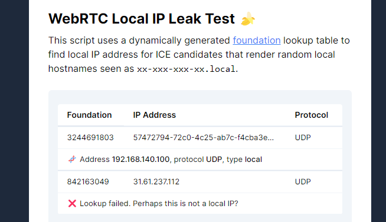

# WebRTC Local IP Leak Test 🍌

A demo page that reveals local IP address(es) from [RTCIceCandidate.foundation](https://developer.mozilla.org/en-US/docs/Web/API/RTCIceCandidate/foundation) parameter of WebRTC candidate report.

For more information and the demo: [https://niespodd.github.io/webrtc-local-ip-leak/](https://niespodd.github.io/webrtc-local-ip-leak/)

### Lookup tables

This repository includes pre-generated lookup tables for IP-s in subnets:
* `192.168.0.0/16`
* `10.0.0.0/8`
* `172.16.0.0/12`
* (extra) `172.0.0.1` - `172.255.255.1` (`0-255` for the two middle bytes) this allows detection of local WSL subnet on Windows hosts  

The output is split into chunks in `db/[0-999].json.gz` because a single file weights easily over 100-s of MBs and loading such in a browser would be (very likely?) painful. Pardon Github!

Use `python lookup_gen.py` to generate your own. There are (only as little as) `255^4` IPv4 so all possible combinations could be generated as well.   

## 🛒 Cross-selling

You may also be interested in: 
* [Avoiding bot detection: How to scrape the web without getting blocked? 👨‍🔧
](https://github.com/niespodd/browser-fingerprinting)
* [ScrapingBee - a cloud web scraping service with some neat built-in anti-bot detection features](https://cutt.ly/VRkHvnL)
